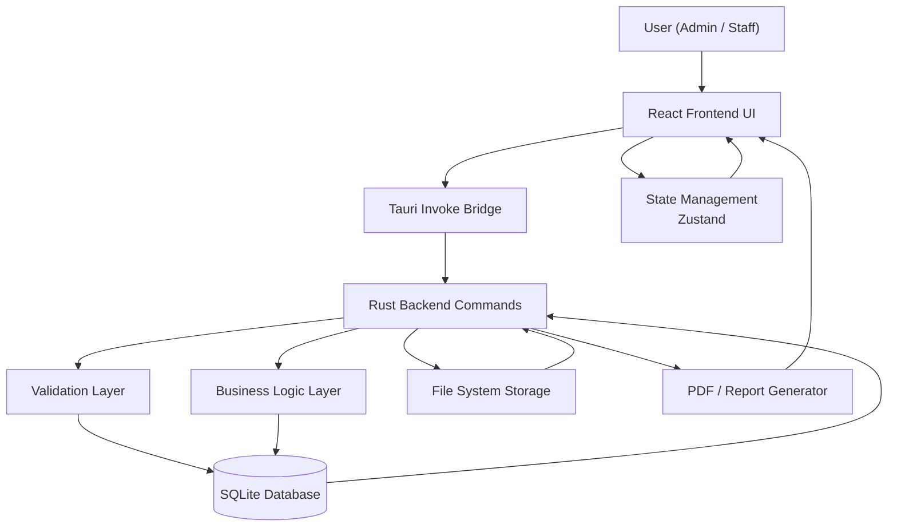
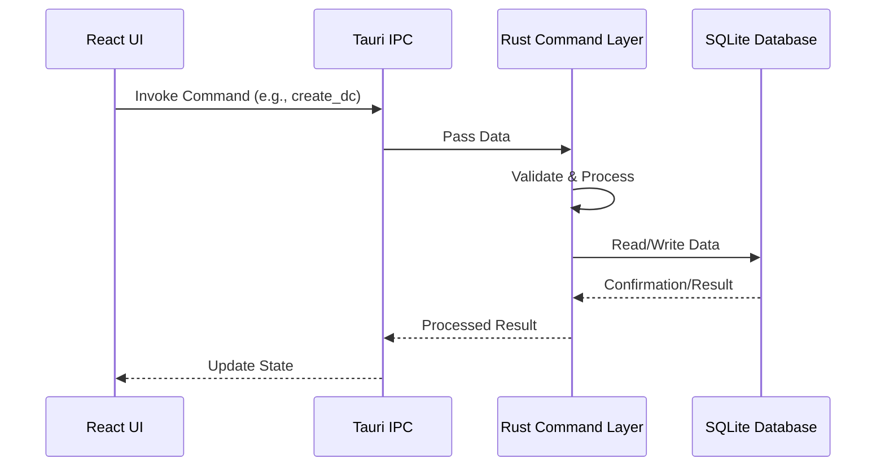
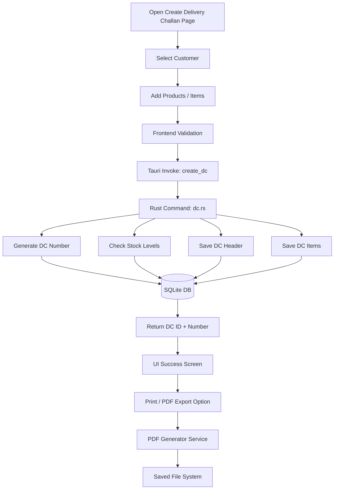
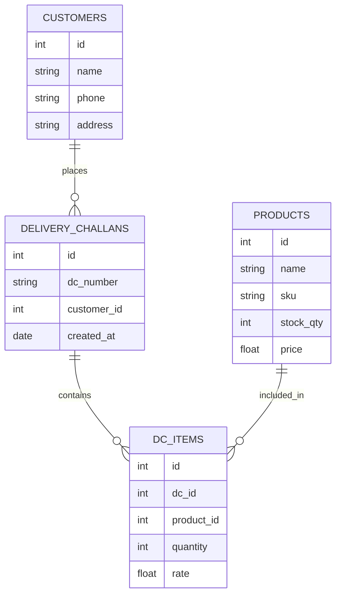

# 🌊 Teebot Flow

**Teebot Flow** is a high-performance, professional Desktop ERP solution designed for modern business operations. Built with a focus on speed, reliability, and ease of use, it leverages the power of **Tauri** and **Rust** to provide a secure, offline-first desktop experience.

Teebot Flow is now open for public collaboration. The project is released under **AGPL-3.0**, and contributions, issue reports, and pull requests are welcome.

---

## 🤝 Open Source & Contribution

- **License**: [LICENSE](LICENSE)
- **Contributing guide**: [CONTRIBUTING.md](CONTRIBUTING.md)
- **Code of conduct**: [CODE_OF_CONDUCT.md](CODE_OF_CONDUCT.md)
- **Security policy**: [SECURITY.md](SECURITY.md)
- **Documentation index**: [docs/README.md](docs/README.md)

---

## 🚀 Key Features

-   **📦 Inventory Management**: Track stock levels with real-time updates.
-   **📄 Delivery Challan System**: Streamlined flow for creating and managing delivery challans.
-   **👥 Customer Management**: Organize customer data and transaction history.
-   **📊 Dashboard KPIs**: Visual insights into business performance.
-   **🖨️ PDF & Export**: Professional report generation and printing capabilities.

---

## 🛠️ Tech Stack

| Layer          | Technology                                                                                                                                                             |
| :------------- | :--------------------------------------------------------------------------------------------------------------------------------------------------------------------- |
| **Frontend**   | [React 19](https://reactjs.org/), [TypeScript](https://www.typescriptlang.org/), [Vite 7](https://vitejs.dev/)                                                         |
| **Styling**    | [Tailwind CSS 4](https://tailwindcss.com/)                                                                                                                            |
| **State**      | [Zustand](https://github.com/pmndrs/zustand)                                                                                                                           |
| **Backend**    | [Rust](https://www.rust-lang.org/) (via [Tauri 2.0](https://tauri.app/))                                                                                                 |
| **Database**   | [SQLite](https://www.sqlite.org/) (Local Storage)                                                                                                                      |
| **UI Icons**   | [Lucide React](https://lucide.dev/)                                                                                                                                    |
| **Charts**     | [Recharts](https://recharts.org/)                                                                                                                                      |

---

## 📐 System Architecture

### 1. System Context Diagram
Below is the high-level overview of how Teebot Flow interacts with the local system and the user.



### 2. Core Application Flow
The bridge between the modern web frontend and the high-performance Rust backend.



---

## 📦 Module Workflow: Delivery Challan

The core workflow for the ERP's Delivery Challan (DC) module.



---

## 🗄️ Data Model (ER Diagram)

Our relational structure ensures data integrity and supports complex business logic. For more technical details on the database design and cloud-sync strategies, see the [Database Architecture Documentation](docs/database-architecture.md).



---

## 🏗️ Folder Structure

```text
teebot-flow/
├── src-tauri/             # Rust Backend (Commands, Database Logic)
├── src/                   # React Frontend
│   ├── components/        # Reusable UI Components
│   ├── modules/           # Feature-based Modules (DC, Inventory, etc.)
│   ├── store/             # Zustand State Stores
│   └── types/             # TypeScript Interfaces
├── public/                # Static Assets
└── package.json           # Frontend Dependencies & Scripts
```

---

## 🛠️ Development Setup

### Prerequisites
-   [Node.js](https://nodejs.org/) (LTS recommended)
-   [Rust](https://www.rust-lang.org/tools/install)
-   Tauri Dependencies (refer to [Tauri Setup Guide](https://tauri.app/v1/guides/getting-started/prerequisites))

### Installation
1. Clone the repository.
2. Install dependencies:
   ```bash
   pnpm install
   ```

### Run Locally
Launch the application in development mode:
```bash
pnpm dev:desktop
```

### Build
Generate the web build or production desktop binary:
```bash
pnpm build
pnpm build:desktop
```

---

## 🛡️ Best Practices & Guidelines

-   **Database First**: Always design and migrate the DB before implementing UI changes.
-   **Logic Separation**: Keep heavy business logic in Rust; UI remains thin and reactive.
-   **Isolation**: Features should be modular to prevent regression.
-   **Security**: Validate all inputs at the Rust layer, even if validated in the frontend.

---
© 2026 Teebot Flow. Licensed under AGPL-3.0.
